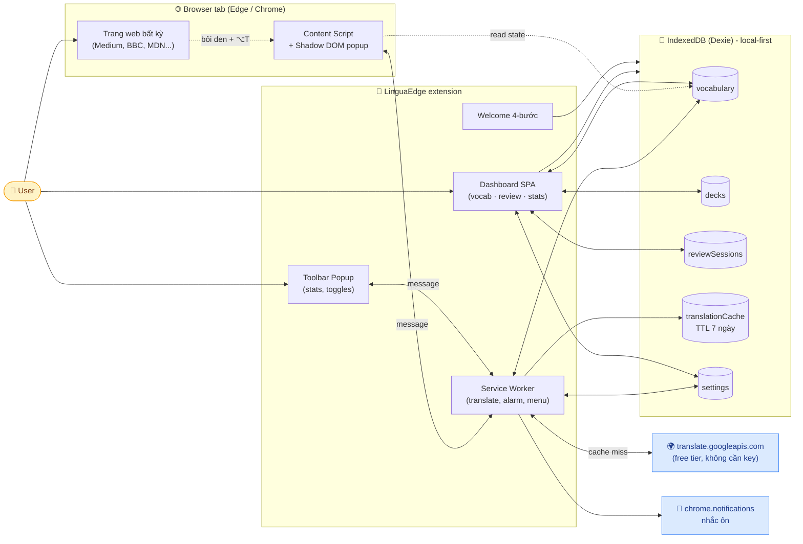
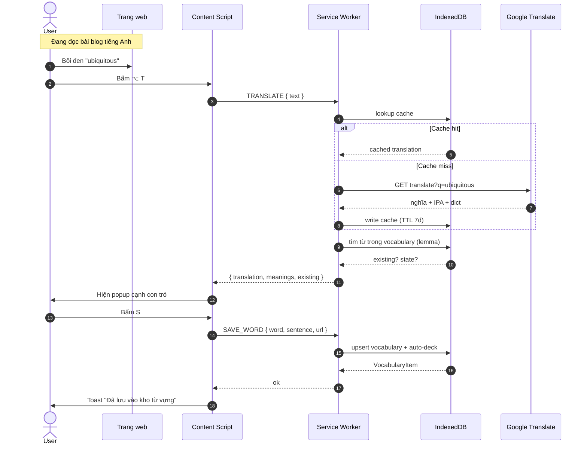
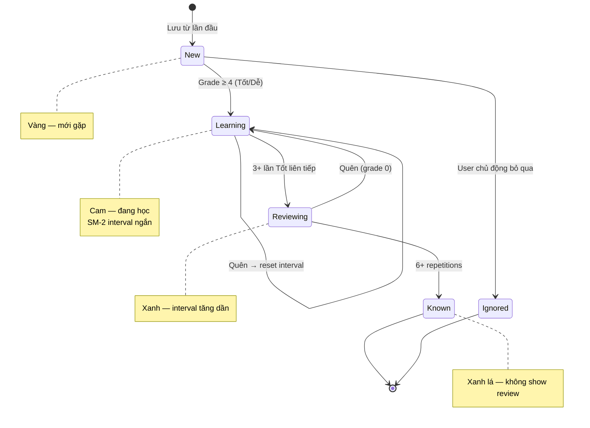

# LinguaEdge

> Extension trình duyệt biến mọi trang web tiếng Anh thành phòng học cá nhân: dịch ngữ cảnh, lưu từ vựng, ôn tập bằng spaced repetition — tất cả trong một workflow liền mạch.

**Pitch 1 câu**: Đọc → Dịch → Lưu → Ôn, không rời trang.

---

## Tài liệu thiết kế

| File | Nội dung |
|------|----------|
| [docs/01-overview.md](docs/01-overview.md) | Tên, định vị, vấn đề, đối tượng người dùng, so sánh đối thủ |
| [docs/02-features.md](docs/02-features.md) | Chi tiết 5 nhóm tính năng (A-E) và scope MVP |
| [docs/03-architecture.md](docs/03-architecture.md) | Kiến trúc kỹ thuật, schema dữ liệu, stack đề xuất |
| [docs/04-user-flows.md](docs/04-user-flows.md) | 7 user flow chính kèm wireframe text |
| [docs/05-roadmap.md](docs/05-roadmap.md) | Lộ trình 5 phase, business model, marketing |
| [extension/README.md](extension/README.md) | Hướng dẫn build & cài đặt extension |

---

## Tính năng MVP (đã build)

### A. Dịch trên web

- **Bôi đen + hotkey** — chọn từ / cụm từ / đoạn văn rồi bấm `⌥ T` (macOS) hoặc `Alt+T` (Windows) → popup dịch hiện cạnh con trỏ. Không tự bật khi bôi đen, không làm phiền khi bạn chỉ copy text.
- **Chuột phải → "LinguaEdge: Dịch"** — phương án dự phòng nếu hotkey bị app khác chiếm.
- **Phát âm bản gốc** (Web Speech API) + **copy bản dịch** từ trong popup.
- **Cache dịch 7 ngày** trong IndexedDB → từ tra lại không gọi API.

### B. Quản lý từ vựng

- **Quick save**: bấm `S` khi popup mở → lưu kèm câu gốc (auto-extract), URL, tiêu đề trang, timestamp.
- **5 trạng thái học** (LingQ-style): 🆕 New · 📖 Learning · 🔁 Reviewing · ✅ Known · 🚫 Ignored — đổi nhanh ngay trong popup.
- **Vocabulary dashboard**: filter theo state / deck / search, bulk action (đổi state, xóa), drill-in xem lịch sử contexts + thông tin SRS.
- **Auto-deck theo domain** (medium, bbc, mdn-docs...) + manual deck do người dùng tạo.

### C. Ôn tập

- **SRS thuật toán SM-2** — interval tăng theo độ khó, lapse reset, ease factor cá nhân hoá.
- **Flashcard mode** — xem từ → tự nhớ nghĩa → 4 mức đánh giá (Quên / Khó / Tốt / Dễ).
- **Cloze mode** — câu gốc bị che một từ, nhớ lại trong ngữ cảnh thật.
- **Mixed mode** — trộn cả hai.
- **Phím tắt review**: `Space` lật / xác nhận, `1`-`4` chọn mức đánh giá.
- **Notification gộp** — kiểm tra mỗi giờ, bật ping tối đa 1 lần / 6 giờ khi có ≥5 từ đến hạn.

### D. Thống kê

- **Heatmap 16 tuần** (kiểu GitHub contribution) — kết hợp số từ lưu mới + số card đã ôn.
- **Phân bố trạng thái** — bar chart 5 state.
- **Streak** — số ngày học liên tục.

### E. Dữ liệu

- **Local-first** qua Dexie + IndexedDB, không có server, không cần đăng ký.
- **Export** JSON / CSV (mở được Excel + Anki) · **Import** JSON.
- **Không gửi dữ liệu trang web ra ngoài** — chỉ phần text bạn chủ động dịch mới qua Google Translate free tier (cùng endpoint extension chính chủ dùng, không cần API key).

---

## Kiến trúc tổng quan



---

## User flow chính



---

## SRS lifecycle



---

## Stack

| Layer | Lựa chọn |
|-------|----------|
| Manifest | V3 (Edge / Chrome / Brave) |
| Language | TypeScript strict |
| UI | React 18 + Vite + Tailwind |
| Build | `@crxjs/vite-plugin` (HMR cho extension) |
| Storage | Dexie 4 trên IndexedDB |
| SRS | SM-2 (tự viết, ~50 LOC) |
| Translate | Google Translate free endpoint |

---

## Cài đặt nhanh

```bash
cd extension
npm install
npm run build       # → extension/dist/
```

Sau đó: `edge://extensions/` → Developer mode → **Load unpacked** → chọn `extension/dist/`.

Chi tiết: [extension/README.md](extension/README.md).

---

## Roadmap

| Phase | Scope | Trạng thái |
|-------|-------|-----------|
| 1. MVP | Selection translate · save · SRS · dashboard · export | ✅ Done |
| 2. Public beta | Paragraph translate (split view) · highlight on-page · multiple choice / listening · Anki .apkg | ⏳ Tiếp theo |
| 3. Differentiation | **Re-encounter mode** (killer feature) · full-page translate · multi-engine (DeepL, BYOK LLM) · article summary | |
| 4. Sync & Mobile | Cloudflare Workers + D1 · web app companion · Firefox | |
| 5. AI deep | BYOK explanation · conversation practice · Pocket / Readwise integration | |

Chi tiết phase + business model: [docs/05-roadmap.md](docs/05-roadmap.md).

---

## Bảo mật & quyền riêng tư

- Toàn bộ kho từ vựng nằm trong IndexedDB của extension trên máy bạn.
- Văn bản dịch đi qua `translate.googleapis.com` (Google Translate free tier).
- Không có analytics tracker bên thứ 3.
- Có thể export JSON / CSV bất cứ lúc nào — dữ liệu là của bạn, không lock-in.

## Khác biệt chính

1. **Re-encounter mode** (phase 3) — tự động hỏi lại từ đã học khi gặp trên web.
2. **Local-first, open data** — export Anki, không lock-in.
3. **Hotkey-driven, không tự popup** — không phá flow đọc / copy / highlight.
